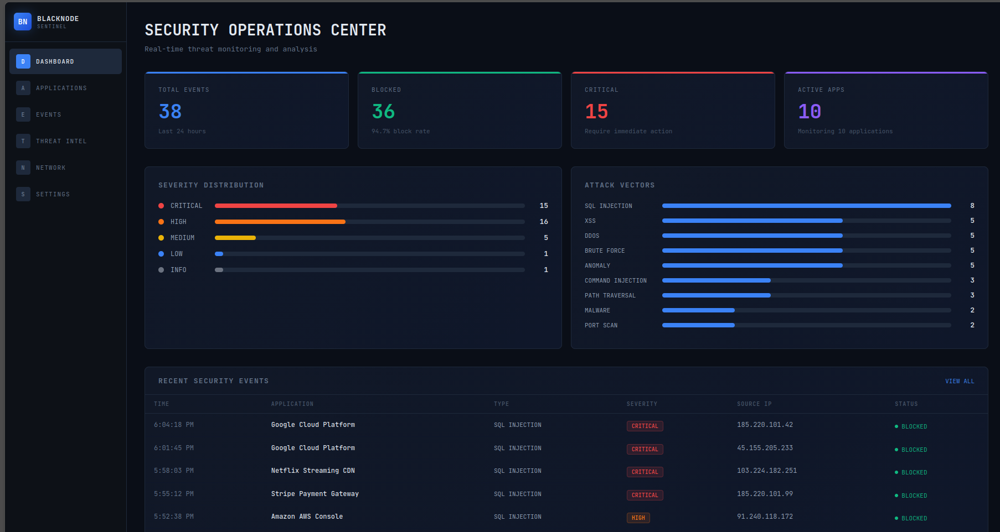
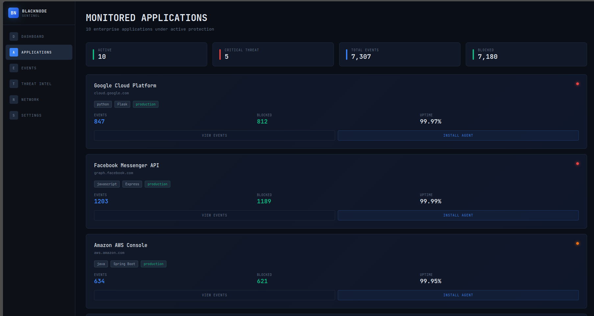
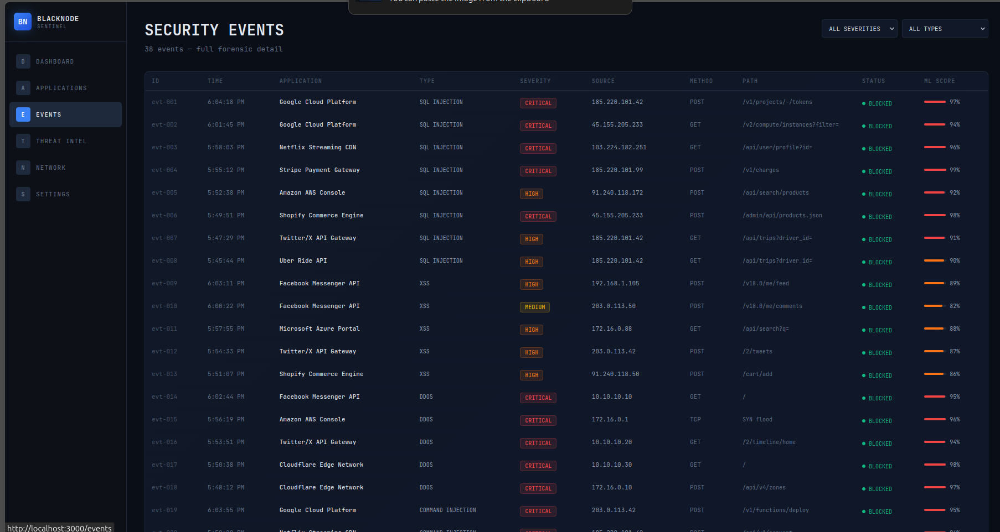
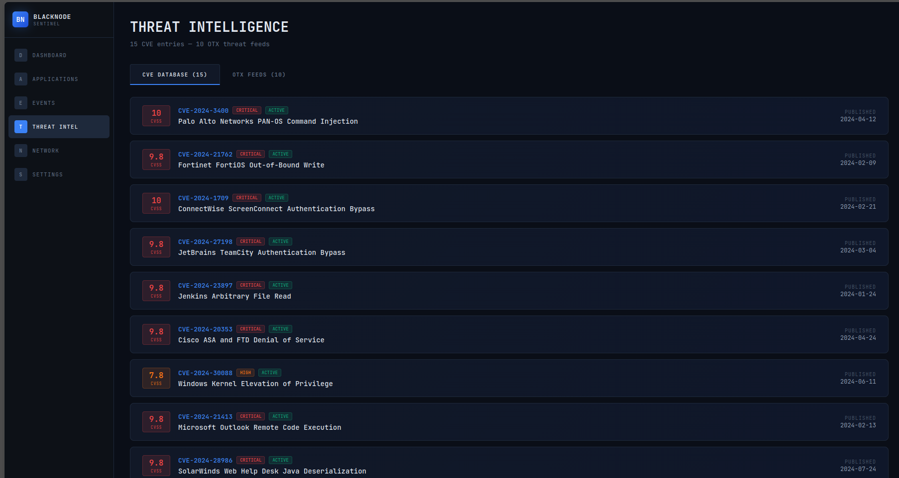
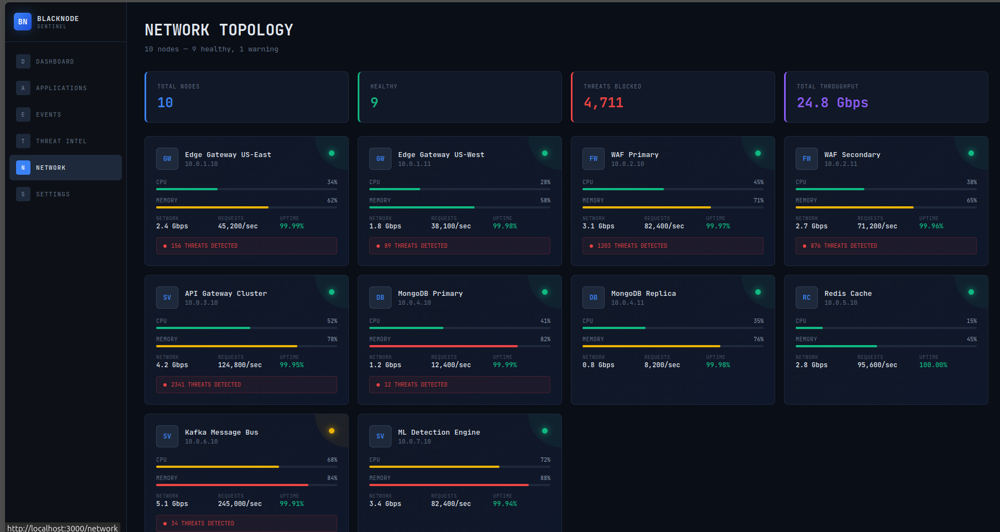
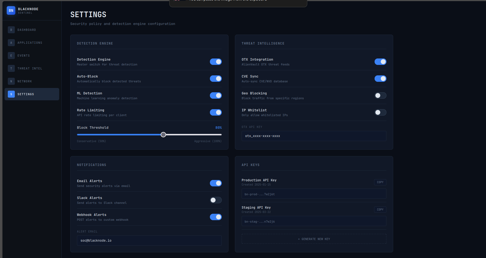

# BlackNode Sentinel

[](https://opensource.org/licenses/MIT)
[](https://github.com/Eagle-AS0/BlackNode-Sentinel)
[](https://www.docker.com/)
[](https://nodejs.org/)

**Runtime Application Security Operations Center**

Monitor, detect, and block cyber threats across your web applications in real-time.

---

## Quick Start

```bash
git clone https://github.com/Eagle-AS0/BlackNode-Sentinel.git
cd BlackNode-Sentinel
cp .env.example .env
docker-compose up --build -d
```

Opens at **http://localhost:3000**

**Login:**
- Email: `admin@blacknode.io`
- Password: `BlackNode2025!`

---

## Screenshots

### Dashboard


### Applications


### Events


### Threat Intelligence


### Network


### Settings


---

## What It Does

BlackNode Sentinel is a RASP (Runtime Application Protection) platform. It watches all HTTP traffic to your web applications and detects attacks in real-time.

### Pages

| Page | What It Shows |
|------|--------------|
| **Dashboard** | Threat overview — severity charts, attack vectors, recent events |
| **Applications** | Monitored enterprise apps with agent install + add new app |
| **Events** | Security events with forensic detail — payloads, IPs, ML scores |
| **Threat Intel** | CVEs + OTX threat feeds — add new CVE or pulse from the UI |
| **Network** | Infrastructure nodes with CPU, memory, throughput, uptime |
| **Settings** | Detection engine toggles, OTX config, alert email, API keys, logout |

### Monitored Companies

1. Google Cloud Platform
2. Facebook Messenger API
3. Amazon AWS Console
4. Netflix Streaming CDN
5. Microsoft Azure Portal
6. Stripe Payment Gateway
7. Uber Ride API
8. Twitter/X API Gateway
9. Shopify Commerce Engine
10. Cloudflare Edge Network

### Attack Types Detected

- SQL Injection (7 events)
- Cross-Site Scripting (5 events)
- Brute Force (5 events)
- DDoS (5 events)
- Command Injection (3 events)
- Path Traversal (3 events)
- Malware (2 events)
- Anomaly (5 events)
- Port Scan (2 events)

---

## How To Use In Production

### 1. Install the agent in your app

```bash
npm install blacknode-agent
```

### 2. Add to your Express/Node.js server

```javascript
const BlackNodeAgent = require('blacknode-agent');

const agent = new BlackNodeAgent({
  serverUrl: 'http://your-sentinel-server:5004',
  agentKey: 'your-agent-key-from-dashboard',
  appUrl: 'https://your-app.com',
});

app.use(agent.middleware());
```

### 3. Open the dashboard

Navigate to the Applications page, click "Install Agent", and copy the code.

---

## Architecture

```
[Your App] ──agent──> [BlackNode Backend] ──> [Dashboard]
                           │
                      [MongoDB]
```

- **Agent** — Express middleware that intercepts and inspects all HTTP requests
- **Backend** — Node.js API with threat detection, event logging, ML scoring
- **Frontend** — React SPA with professional cybersecurity UI
- **MongoDB** — Event storage and application registry

---

## Development

```bash
# Frontend only (hot reload)
cd frontend && npm install && npm start

# Backend only
cd backend && npm install && npm run dev

# Full stack with Docker
docker-compose up --build -d
```

---

## Tech Stack

- **Frontend:** React, Vite, anime.js, Recharts
- **Backend:** Node.js, Express, Mongoose, Socket.IO
- **Database:** MongoDB 7
- **Deployment:** Docker Compose, Nginx
- **Theme:** Professional cybersecurity dark UI

---

## Contributing

Contributions are welcome! Please read [CONTRIBUTING.md](CONTRIBUTING.md) before submitting a PR.

1. Fork the repository
2. Create your feature branch (`git checkout -b feat/my-feature`)
3. Commit your changes (`git commit -m 'feat: add my feature'`)
4. Push to the branch (`git push origin feat/my-feature`)
5. Open a Pull Request

---

## License

MIT
